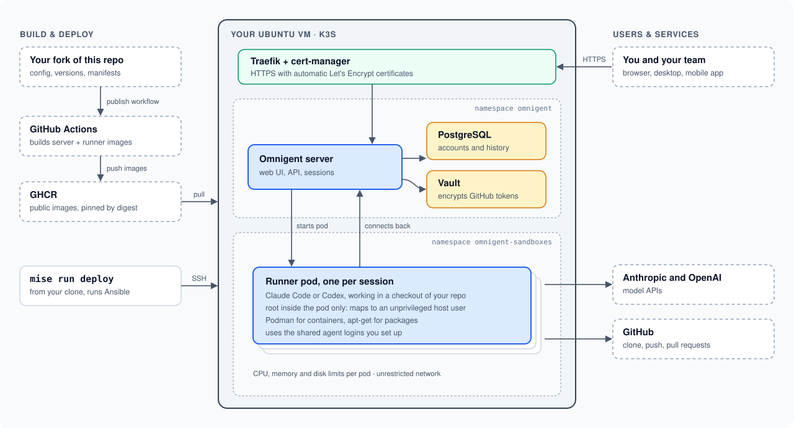

# Omnigent deployment

Deploy your own [Omnigent](https://github.com/omnigent-ai/omnigent) server on a
single Ubuntu VM. One command provisions a fresh VM and later reconciles any
change you commit.

What you get:

- k3s with Traefik and cert-manager (automatic HTTPS)
- one Omnigent server, PostgreSQL, and a small in-cluster Vault
- agent sessions in Kubernetes runner Pods that stop after 4 idle hours
  and keep their files until you delete the session
- a few features on top of upstream Omnigent, such as showing your Claude and
  Codex usage limits in the Omnigent UI, and Podman inside runners. See
  [custom features](docs/CUSTOM_FEATURES.md).

Images are built by GitHub Actions, published to your GHCR namespace, and
deployed by digest.



## Prerequisites

- An x86_64 Ubuntu 22.04+ VM that you can reach over SSH as a user with sudo.
  2 vCPU, 4 GiB RAM and 40 GB disk is enough for a session or two at a time.
  Each extra concurrent session needs about 0.5 vCPU and 1 GiB more.
- A DNS name pointing at the VM.
- A private way to reach the VM's Kubernetes API (port 6443), which the
  firewall blocks on the public interface. [Tailscale](https://tailscale.com)
  on the VM and your machine is the easiest; it's also how GitHub Actions
  connects.
- On your machine: [mise](https://mise.jdx.dev), Docker with Buildx, `jq`, and
  OpenSSH. Mise installs the pinned Python, Ansible and kubectl versions.

## Set up your own deployment

1. **Fork this repository** and keep it public, so the VM can pull its GHCR
   images without registry credentials.

2. **Edit the configuration** for your setup:

   - `ansible/inventory/production/hosts.yml`: SSH host and user of your VM.
   - `ansible/inventory/production/group_vars/all.yml`: your VM's size
     (bootstrap refuses smaller hosts), and any private CIDR allowed to reach
     the Kubernetes API.
   - `environments/production.toml`: hostname, ACME and admin email,
     `image_registry` (`ghcr.io/<your-github-user>`), resource limits,
     runner concurrency, `kubernetes_api_host` (the VM's private name, such
     as its Tailscale MagicDNS name), and `deploy_github_repository_id`
     (your fork's numeric ID, from `gh api repos/OWNER/REPO --jq .id`; remove
     it if you won't deploy from GitHub Actions).

3. **Install the tools:**

   ```bash
   mise install
   ```

4. **Publish the images.** Run the `Publish immutable images` workflow from the
   Actions tab of your fork. Make both new GHCR packages public, then, with
   the commit the workflow built checked out, pin their digests:

   ```bash
   mise run lock-images
   git commit -am "Lock image digests"
   ```

5. **Bootstrap the VM.** This is the only step that needs SSH and sudo; it
   asks for your sudo password:

   ```bash
   mise run bootstrap
   git add environments/production.kubernetes-ca.crt
   git commit -m "Record the cluster CA"
   ```

   It installs k3s, cert-manager and the agent-sandbox controller, and
   applies the platform: namespaces, runner security policies, quotas and
   access rules. It also saves an admin kubeconfig to
   `~/.kube/omnigent-production.yaml`, and records the cluster CA for GitHub
   Actions. Use a clean VM: it refuses to take over an existing `omnigent`
   namespace.

6. **Deploy the application.** This needs only the Kubernetes API:

   ```bash
   mise run diff
   mise run deploy
   ```

   The deploy is idempotent. It creates internal secrets, applies the
   manifests, waits for the rollout and checks the public HTTPS endpoint.

7. **Sign in.** Open your HTTPS URL and claim the admin account with the admin
   email you configured.

8. **Connect at least one agent:**

   ```bash
   mise run setup-codex        # Codex device login
   mise run setup-claude       # Claude subscription token
   ```

9. **Give runners access to your repositories.** Pick one of these:

   ```bash
   mise run setup-github-app   # GitHub App (recommended)
   mise run setup-git-token    # a single HTTPS Git token
   ```

   The GitHub App adds a repository picker and gives each user their own
   access. It reaches whichever repositories the App is installed on,
   including private ones. `setup-github-app` prints the App settings to use,
   then asks for its Client ID, secret and slug. Afterwards, connect GitHub
   under Settings -> Sandbox Integrations.

   A Git token is simpler to set up, but every session shares the same token
   and there's no repository picker.

Runners that already exist keep their old credentials, so start a new session
after rotating one.

## Making changes

Change files in Git, never on the server or in the cluster, then run:

```bash
mise run check
mise run diff
mise run deploy
mise run status              # health, TLS, storage, failed runners
mise run credential-status   # which credentials are present
```

Changes to `ansible/`, `kubernetes/platform/`, the k3s, cert-manager or
agent-sandbox entries in `versions.yaml`, or the environment's hostname,
Kubernetes API host or GitHub deploy settings also need `mise run bootstrap`
first. `mise run deploy` compares the cluster with your checkout and refuses to run until you
have. Other version bumps, such as the agent CLIs, only need a deploy.

- **Upgrade versions** in `versions.yaml`, then deploy (bootstrap first for
  k3s, cert-manager or agent-sandbox).
- **Change images** (`images/`): push the change, then run **Deploy**, which
  builds, locks and deploys them. From your machine: run the publish workflow
  on your pushed commit, then, with that commit checked out,
  `mise run lock-images`, commit and deploy.
- **Roll back** by reverting the commit and deploying again.

Production is never deployed automatically. You can also release from
GitHub Actions; see below.

## Deploying from GitHub Actions

The `Deploy` workflow builds both images, commits their digests to
`production.toml` on `main`, and deploys that commit, all after one approval
when the run starts. It only runs when started by hand from the Actions tab,
only from `main`, and only in the `production` Environment. It stores no
credentials: it joins your tailnet and authenticates to Kubernetes with the
job's short-lived GitHub OIDC token. `mise run bootstrap` configures the VM's
Kubernetes API to accept that token only from your repository's `production`
Environment on `main`, and it can only manage the application in the two
Omnigent namespaces. It can't change the platform or touch the VM, but the job
can also push images to GHCR and commit to `main`.

1. **Run `mise run bootstrap`** with `deploy_github_repository_id` and
   `kubernetes_api_host` set, and commit
   `environments/production.kubernetes-ca.crt`.

2. **Set up Tailscale for CI.** In the Tailscale admin console:

   - Add `tag:omnigent` and `tag:omnigent-ci` to `tagOwners`, and tag the VM
     `tag:omnigent`, keeping any tags it already has. Allow `tag:omnigent-ci`
     to reach `tag:omnigent` on `tcp:6443` and nothing else.
   - Under Trust credentials, add an OpenID Connect credential with issuer
     `https://token.actions.githubusercontent.com`, the `auth_keys` write
     scope and tag `tag:omnigent-ci`. Set its subject to your repository's
     `production` Environment. Repositories created after July 15, 2026 use
     `repo:OWNER@OWNER_ID/REPO@REPO_ID:environment:production`; older ones use
     `repo:OWNER/REPO:environment:production`.

3. **Create the `production` Environment** under Settings -> Environments.
   Add yourself as a required reviewer, limit deployment branches to `main`,
   and add two Environment secrets from step 2: `TS_OAUTH_CLIENT_ID` and
   `TS_AUDIENCE`. They aren't sensitive, but secrets are masked in public run
   logs.

A run you approve can still read and change everything in the two Omnigent
namespaces, including the database and all secrets, and it decides which
images and digest commit production gets. See the
[threat model](docs/THREAT_MODEL.md#deploying-from-github-actions).

`mise run bootstrap` and the credential setup tasks (`setup-codex`,
`setup-claude`, `setup-git-token`, `setup-github-app`) still run from your
machine.

## Things to know

- **No backups.** If the VM or its disk is lost, so is the data. Recovery
  means a fresh VM, a new deploy and signing in again.
- **Runners are trusted.** They have unrestricted network access and share
  the operator's agent logins. Agents are root inside their own Pod so they can
  install packages, but a user namespace maps that root to an unprivileged
  user on the host. That suits a single operator or a trusted team. Read the
  [threat model](docs/THREAT_MODEL.md) before inviting others.
- **Agents skip permission prompts** by default. Turn off
  `claude_bypass_permissions` and `codex_bypass_approvals` in
  `environments/production.toml` to change that.
- **Sessions keep their disk until you delete them.** An idle session's Pod
  stops, but its home directory stays on the VM's disk. Delete sessions you're
  done with. See [idle sessions](docs/CUSTOM_FEATURES.md#idle-sessions-stop-and-keep-their-files).
