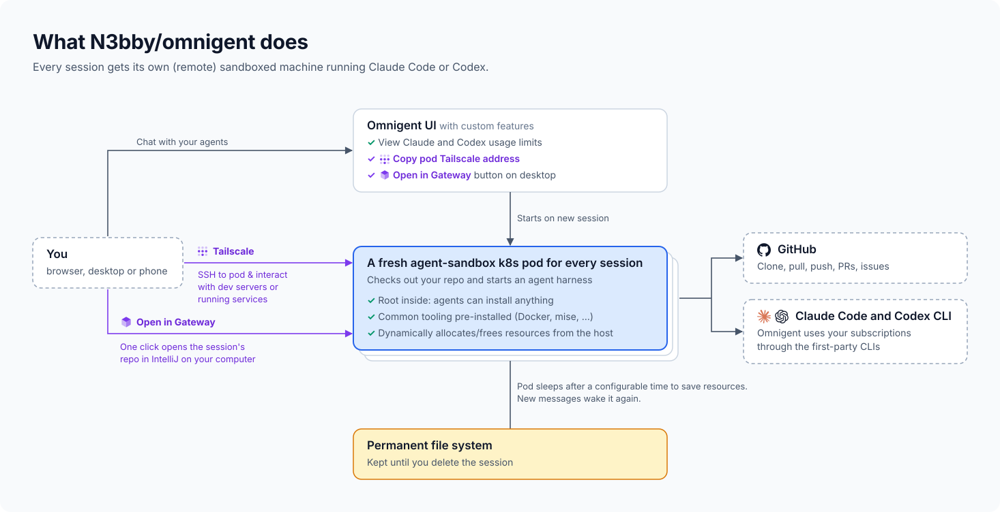
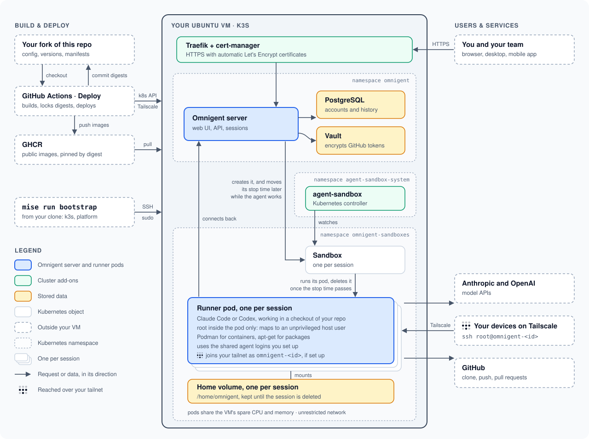

# Omnigent deployment

Run your own [Omnigent](https://github.com/omnigent-ai/omnigent) server on a
single Ubuntu VM. One command sets up a fresh VM. After that, you change
files in Git and deploy them.

## What you get

- **A small Kubernetes cluster** (k3s) with automatic HTTPS.
- **One Omnigent server**, with PostgreSQL and a small Vault for secrets.
- **One Pod per agent session.** It stops after 4 idle hours and keeps its
  files until you delete the session.
- **Extras on top of upstream Omnigent**, such as your Claude and Codex usage
  limits in the UI, Docker inside sessions, and SSH into a session over
  Tailscale. See [custom features](docs/features/README.md).

GitHub Actions builds the images and publishes them to your GHCR namespace.
Deploys pin each image by its digest.

## Get started

1. Check the [prerequisites](docs/setup.md#what-you-need).
2. Follow [set up your own deployment](docs/setup.md).
3. Read [making changes](docs/operations.md) for day-to-day work.

All the documentation is listed in [docs/](docs/README.md).

## Things to know

- **There are no backups.** If you lose the VM or its disk, you lose the
  data. To recover, you set up a fresh VM, deploy again and sign in again.
- **Sessions are trusted.** They have full network access and share your
  agent logins. Agents are root inside their own Pod, but that root is an
  ordinary user on the VM. This suits one person or a team who trust each
  other. Read the [threat model](docs/threat-model.md) before you invite
  anyone else.
- **Agents don't ask for permission** before running commands.
  [You can turn that off](docs/features/no-permission-prompts.md).
- **Sessions keep using disk until you delete them**, even once they're idle.
  See [idle sessions](docs/features/idle-sessions.md).
