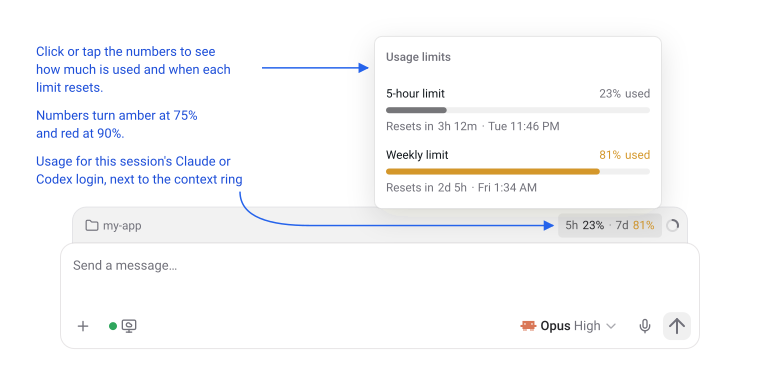
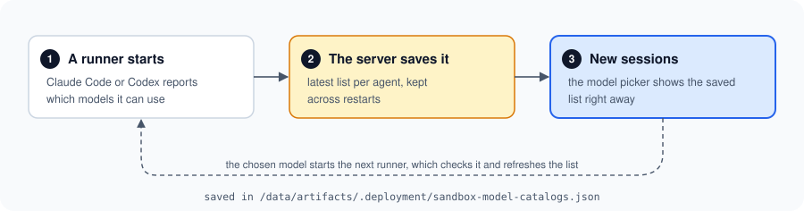
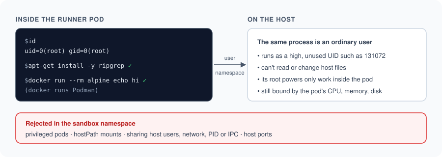
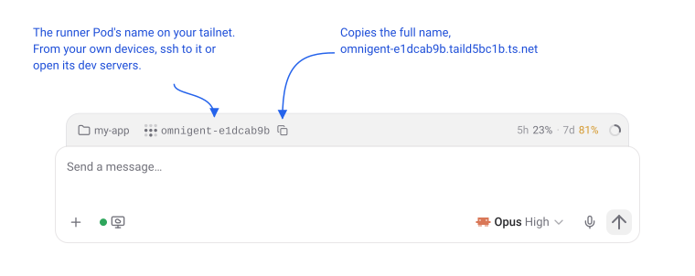

# Custom features

This deployment runs upstream Omnigent `v0.15.0` (pinned as `omnigent_commit`
in `versions.yaml`) with a few extras on top. This page explains what each one
does, what you'll notice, and how to turn it off where that's possible.

| Feature | What you get | Can you turn it off? |
| --- | --- | --- |
| [Usage limits in the UI](#see-your-usage-limits) | Your Claude and Codex usage, right in the composer | No |
| [Model picker before the first session](#pick-a-model-straight-away) | Choose a model without starting a session first | No |
| [Root and containers in runners](#install-packages-and-run-containers) | Agents can `apt-get install`, and use Docker, Compose and Testcontainers | No |
| [No permission prompts](#agents-dont-stop-to-ask) | Agents work without waiting for approval | Yes, one setting per agent |
| [GitHub repository picker](#pick-repositories-from-github) | Choose repositories from a list | Optional setup step |
| [Idle sessions stop](#idle-sessions-stop-and-keep-their-files) | Idle runner Pods free their CPU and memory, and keep their files | You can change the timing |
| [Runners on your tailnet](#reach-a-session-over-tailscale) | SSH into a session's Pod, or open its dev servers, from your own devices | Optional setup step |

## See your usage limits

Claude and Codex subscriptions have a 5-hour limit and a weekly limit. The
composer shows how much of each you've used, next to the context ring, so you
don't hit a limit halfway through a task. Click or tap the numbers to see bars
and reset times. It works in the browser and in the desktop and mobile apps.



The numbers appear once the agent first reports them. For Claude that's after
its first reply; for Codex it's when the first turn starts. They belong to the
login, so every session using the same account shows the same numbers.

<details>
<summary>How it works</summary>

Three small patches work together:

- **Runner** (`images/runner/patches/0001-rate-limits.patch`): passes on the
  usage numbers that the Claude and Codex CLIs report.
- **Server** (`images/server/patches/0002-rate-limits.patch`): keeps the latest
  numbers per session and sends them to the UI.
- **Web UI** (`images/server/web-patches/0001-composer-rate-limits.patch`):
  adds the `ComposerRateLimits` display.

The upstream server image comes with a prebuilt web UI, so the server image
build rebuilds the UI from source with the web patch applied.

</details>

## Pick a model straight away

Upstream Omnigent can only list models once a runner has started. With
subscription logins, the model picker would say "Models unavailable" until
then. This deployment remembers the list that runners last reported and shows
it straight away. The runner still checks the chosen model when it starts.



On a brand-new install the list is empty until the first session has run once.

<details>
<summary>How it works</summary>

The server patch (`images/server/patches/0001-sandbox-model-catalog-fallback.patch`)
saves the list to the artifacts volume, at the path set by
`OMNIGENT_SANDBOX_CATALOG_FALLBACK_PATH` in `scripts/render`.

</details>

## Install packages and run containers

Agents in a runner are root, so they can install whatever a task needs with
`apt-get install`. They can also build and run containers with Podman. The
usual Docker tools work too: `docker` commands, `docker compose` with a
`compose.yaml`, and test libraries like Testcontainers.

That root only applies inside the pod. A Linux user namespace maps it to an
ordinary, unprivileged user on the host.



Published ports (`-p 8080:80`, or `ports:` in compose) are reachable on
`localhost` inside the runner, and compose services can reach each other by
name.

A few things don't work:

- `docker buildx` and BuildKit. `docker build` and compose `build:` services
  still work, using Podman's builder.
- per-container resource limits (the pod's limits still apply)

Container images live in the runner's home volume, so they're still there
after an [idle session](#idle-sessions-stop-and-keep-their-files) wakes up.

<details>
<summary>How it works</summary>

- `kubernetes/base/runner-userns.yaml` holds two admission policies. One makes
  every runner pod use its own user namespace (`hostUsers: false`) and run as
  UID 0. The other rejects pods in `omnigent-sandboxes` that are privileged,
  mount `hostPath`, share host namespaces, or use host ports.
- The runner image installs Podman with `docker` as an alias, and Docker
  Compose, configured by `images/runner/containers/`. Containers run without
  their own cgroups, because containerd doesn't hand cgroups to
  user-namespaced pods.
- `omnigent-podman-service` starts when the pod starts and serves the Docker
  API at `/var/run/docker.sock`, which is where Docker tools look by default.
  It also runs container healthchecks, which Podman normally leaves to
  systemd, so `depends_on: service_healthy` works.
- After upgrading k3s, run `scripts/check-userns` on the VM to check that
  all of this still works.

</details>

## Agents don't stop to ask

By default, Claude Code and Codex run without asking for approval before each
command or edit. The runner sandbox is what keeps them contained. See the
[threat model](THREAT_MODEL.md) for what that does and doesn't protect.

To make an agent ask again, turn off its setting in
`environments/production.toml` and deploy:

| Setting | Agent |
| --- | --- |
| `claude_bypass_permissions` | Claude Code |
| `codex_bypass_approvals` | Codex |

New runners use the new setting; runners that already exist keep the old one.

<details>
<summary>How it works</summary>

- **Claude Code** (`images/runner/claude-wrapper.sh`): writes
  `/etc/claude-code/managed-settings.json` with
  `defaultMode: bypassPermissions`, which a session's own settings can't
  override. It also sets `skipDangerousModePermissionPrompt`, because Claude
  Code otherwise shows a one-time consent dialog that Omnigent can't answer.
- **Codex** (`images/runner/codex-wrapper.sh`): adds
  `--dangerously-bypass-approvals-and-sandbox`. It also links the shared Codex
  login into each session.

</details>

## Pick repositories from GitHub

Connect a GitHub App and you can pick repositories from your GitHub account
when you start a session. Runners can clone and push to whichever
repositories the App is installed on, private ones included, so you don't
also need `mise run setup-git-token`.

1. Run `mise run setup-github-app`. It prints the settings to use for a new
   GitHub App, then asks for its Client ID, Client secret and slug.
2. In Omnigent, go to Settings -> Sandbox Integrations and connect GitHub.

Each user's GitHub tokens are encrypted by a small Vault service inside the
cluster before they're stored in the database.

<details>
<summary>How it works</summary>

Vault runs from `kubernetes/base/vault.yaml` and uses its Transit engine for
the encryption. The key that unlocks Vault is stored in a Kubernetes Secret,
so Vault comes back by itself after a restart. The server image adds the
`hvac` Python client so the server can talk to Vault.

</details>

## Idle sessions stop and keep their files

An idle session winds down in two steps:

1. After 30 minutes without agent activity, the agent exits. The Pod keeps
   running, so everything in it is still there.
2. After 4 hours without agent activity, the Pod stops, which frees the CPU
   and memory it reserved. Sending a message wakes it again, which takes
   about as long as starting a new session.

The session keeps its home directory, `/home/omnigent`: your repositories,
uncommitted changes, agent state and Podman images are where you left them. The home directory is only deleted
when you delete the session.

Anything outside the home directory starts fresh when a stopped Pod wakes,
including packages from `apt-get install`. Have agents install tools into the
home directory, for example with `pip install --user` or `npm --prefix`, if
they should survive.

Stopped sessions still use disk. `local-path` doesn't enforce the volume size,
`runner_home_limit`, so delete sessions you're done with. `mise run status`
lists every session's volume, and shows stopped sessions as `Ready=False`,
`SandboxExpired`.

Until it stops, an idle Pod still counts towards `runner_max_concurrency` and
the VM's capacity, so with many sessions a new one may have to wait for an
old one to stop or be deleted.

To change the timing, set these in `environments/production.toml` and
deploy:

| Setting | What it sets | Default |
| --- | --- | --- |
| `runner_agent_idle_seconds` | Idle time before the agent exits | 1800 (30 minutes) |
| `runner_idle_shutdown_seconds` | Idle time before the Pod stops | 14400 (4 hours) |

The Pod has to stop at least 300 seconds after the agent exits. Pods that
are already running keep their old timing until they stop.

<details>
<summary>How it works</summary>

- Runner Pods are `Sandbox` objects of the
  [agent-sandbox](https://github.com/kubernetes-sigs/agent-sandbox)
  controller, which `mise run bootstrap` installs. Upstream Omnigent's
  `agent_sandbox` provider manages them.
- While a runner is connected, the server keeps pushing the Sandbox's
  `shutdownTime` forward. The runner exits once it has been idle for
  `runner_agent_idle_seconds` (Omnigent's `keep_warm_s`). The rest of
  `runner_idle_shutdown_seconds` later, the deadline passes and the controller
  deletes the Pod. The Sandbox and its volume stay.
- `OMNIGENT_AGENT_SANDBOX_WORKSPACE_SIZE` in `scripts/render` puts the home
  directory on a per-session `local-path` volume instead of an `emptyDir`.
- Deleting the session deletes the Sandbox, and Kubernetes deletes its volume
  with it.

</details>

## Reach a session over Tailscale

Each session's runner Pod can join your tailnet as an ephemeral node. The
composer shows its name next to the working directory, with a button that
copies the full name:

```
omnigent-e1dcab9b                      what the composer shows
omnigent-e1dcab9b.taild5bc1b.ts.net    what the copy button copies
```



The `e1dcab9b` comes from the session's host ID, so the name stays the same
for as long as the session exists, including after an
[idle Pod stops and wakes](#idle-sessions-stop-and-keep-their-files). From a
device on your tailnet:

```bash
ssh root@omnigent-e1dcab9b               # a shell in the Pod, by Tailscale SSH
curl http://omnigent-e1dcab9b:3000       # a dev server the agent started
```

Any port a process in the Pod listens on is reachable, whether it listens on
`localhost` or on all addresses. The short name needs MagicDNS on your device;
the full name works either way.

To set it up:

1. In your [tailnet policy](https://login.tailscale.com/admin/acls), add a tag
   for runners, let your own devices reach it, and give runners no access of
   their own. Keep it separate from the VM's `tag:omnigent`, so access you
   give one doesn't also apply to the other. For example:

   ```json
   "tagOwners": {"tag:omnigent-runner": ["autogroup:admin"]},
   "grants": [
     {"src": ["autogroup:member"], "dst": ["tag:omnigent-runner"], "ip": ["*"]}
   ],
   "ssh": [
     {"action": "accept", "src": ["autogroup:member"], "dst": ["tag:omnigent-runner"], "users": ["root"]}
   ]
   ```

   Check that no other rule, such as the default allow-all one, lets
   `tag:omnigent-runner` reach your other devices. See the
   [threat model](THREAT_MODEL.md#runners-on-your-tailnet) for why.
2. Create an [OAuth client](https://login.tailscale.com/admin/settings/oauth)
   with the **Auth Keys: Write** scope and only the `tag:omnigent-runner` tag.
   It can only create keys for that tag. A reusable, ephemeral, pre-approved
   auth key with the tag also works, but expires within 90 days.
3. Run `mise run setup-tailscale` and paste the client secret or key.
4. Set `tailscale_tailnet` in `environments/production.toml` to your tailnet's
   MagicDNS suffix, from the
   [DNS page](https://login.tailscale.com/admin/dns), and deploy.

New sessions join straight away. Existing sessions join, and show their name,
the next time their Pod wakes. To use a different tag, set `tailscale_tags`
(comma-separated) and create the OAuth client with that tag.

Tailscale removes an ephemeral node soon after it goes offline, so stopped
and deleted sessions don't pile up in your machine list. A woken Pod joins
again under the same name.

<details>
<summary>How it works</summary>

- **Runner image:** installs the pinned `tailscale` and `tailscaled` binaries
  (`tailscale` and `tailscale_sha256` in `versions.yaml`).
  `images/runner/tailscale/tailscale-service.sh` starts when the Pod starts,
  like the Podman service. It joins as `omnigent-<first 8 characters of
  OMNIGENT_HOST_ID>`, with `--ssh` and the tags in `OMNIGENT_TAILSCALE_TAGS`.
  The Pod has no TUN device, so `tailscaled` uses userspace networking.
- **Key:** `TAILSCALE_AUTHKEY` in the `omnigent-creds` Secret. An OAuth client
  secret gets `?ephemeral=true&preauthorized=true`, so each Pod mints its own
  ephemeral, pre-approved key.
- **Same name after a wake:** the node's state is kept in
  `~/.local/state/omnigent-tailscale` on the session's home volume, so a
  woken Pod rejoins as the same node, with the same SSH host keys. If
  Omnigent has to rebuild a lost sandbox from scratch while the old node is
  still listed, Tailscale names the new node `omnigent-e1dcab9b-1`. The Pod
  logs that to `/run/omnigent-tailscale.log`, and the name in the composer
  won't reach it until the old node is gone.
- **Server** (`images/server/patches/0003-tailscale-host.patch`): when it
  launches or wakes a session's Pod, it stores the same name, with
  `OMNIGENT_TAILSCALE_TAILNET` appended, in the `omnigent.tailscale_host`
  session label, and sends it to open browsers.
- **Web UI** (`images/server/web-patches/0002-composer-tailscale-host.patch`):
  adds the `ComposerTailscaleHost` chip.

The server works the name out instead of asking the Pod, so the composer
shows it even if the Pod couldn't join. Check `/run/omnigent-tailscale.log`
in the Pod, or `mise run credential-status` for the key.

</details>

## Keeping the patches up to date

The patches are applied when the images are built. If a patch no longer
applies to the pinned `omnigent_commit`, the image build and `mise run test`
fail. Once upstream Omnigent ships the same behaviour, delete the patch. Once
no web patches are left, the server image can stop rebuilding the web UI.
