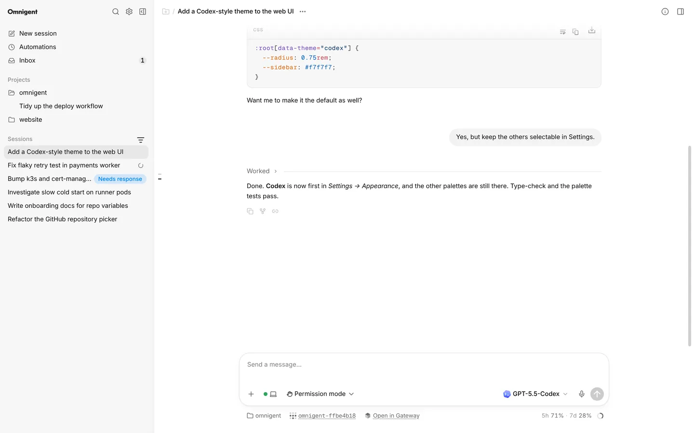
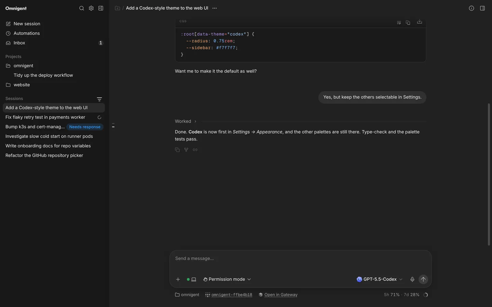

# Codex theme

A colour theme that makes the web UI look like the Codex desktop app. Pick
**Codex** in **Settings → Appearance → Color theme**. It works in light and
dark mode.

## What you'll notice

It changes more than the colours:

- **Neutral greys** instead of the pink accent. Buttons are black in light
  mode and white in dark mode, and blue marks only what needs your
  attention, such as **Needs response**.
- **The system font**, San Francisco on a Mac and Segoe UI on Windows,
  smoothed like a native app.
- **A flat grey sidebar** with a hairline edge, compact rows, quiet section
  labels and a grey highlight for the open session.
- **Your messages in a soft grey bubble**, with the agent's replies as plain
  text.
- **"Worked" is followed by a thin line** that marks where the agent's work
  for a turn ends.
- **Flat code blocks** with a small language label and no line numbers.
- **A rounder composer** with a soft shadow and a round send button. The
  working directory, branch and Tailscale name move underneath it and stay
  there when messages are queued. Queued messages and the sub-agent tray
  still sit above the composer.
- **A terminal mark** above "What should we build?" instead of the starfish.
- **Rounder menus and dialogs** with a hairline edge.

## Good to know

- The other colour themes are still there, and Omnigent is still the
  default.
- The theme is saved in the browser, so pick it once on each device.
- Changing **Accent**, **Background tint** or **Contrast** under the
  palette switches to a custom palette, which keeps only the colours. Pick
  **Codex** again to get the full look back.
- The **Font** setting in Appearance still applies on top of the theme.

## Turning it off

Pick another colour theme in **Settings → Appearance**.

## How it works

The web UI patch `images/server/web-patches/0011-codex-theme.patch`:

- adds a `codex` palette to `web/src/lib/themePalette.ts`, with its colours
  for light and dark mode, and regenerates
  `web/src/themePalettes.generated.css` from it
- adds `web/src/codexTheme.css`, imported by `web/src/index.css`, with the
  layout and type changes. Every rule is scoped to `[data-theme="codex"]`,
  the attribute upstream sets on `<html>` for the chosen palette, so the
  other palettes don't change.
