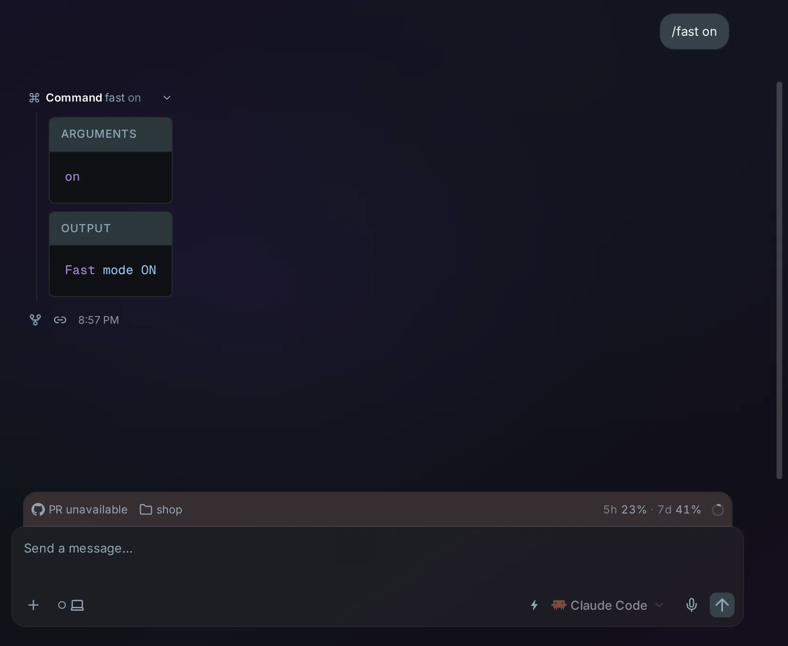
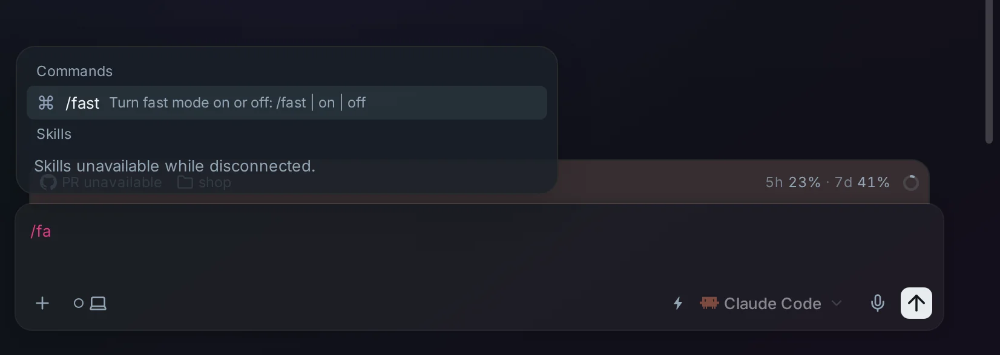

# Fast mode from the chat

Claude Code and Codex both have a fast mode that answers faster and uses
your limits faster. Turn it on or off by sending `/fast` in the chat, without
opening the session's terminal. While it's on, a small lightning bolt shows
left of the model selector.

Hover over the bolt to see what it means.

## Using it

- Send `/fast` to switch it: on when it's off, off when it's on.
- Send `/fast on` or `/fast off` to set it either way.
- `/fast` is in the slash menu of Claude and Codex sessions.

  

- Typing `/fast` in the session's terminal still works, and the chat shows the
  change too.

## Good to know

- **It applies from the next turn.** Sent while the agent is working, it
  doesn't change the turn already running.
- **For Claude, the chat shows the result.** The command appears in the
  chat; open it to see `Fast mode ON`, or the reason fast mode isn't
  available, for example a model that doesn't support it. For Codex, the
  bolt appearing or going is the answer.
- **It stays on until you turn it off,** also after an idle session wakes up
  again. Each session has its own setting, because each runs in its own Pod
  with its own home directory.
- **The bolt appears once the agent reports it.** For Claude, that's when
  its status line first updates. For Codex, it's when the first turn starts.

## Turning it off

You can't turn the feature off. Fast mode itself is off until you send
`/fast`.

## How it works

Three patches work together:

| Part | Patch | What it does |
| --- | --- | --- |
| Runner | `images/runner/patches/0004-fast-mode.patch` | Lets `/fast` reach Claude Code and switches Codex's service tier. Reports whether fast mode is on. |
| Server | `images/server/patches/0008-fast-mode.patch` | Keeps the latest state for each session and sends it to the UI. |
| Web UI | `images/server/web-patches/0009-composer-fast-mode.patch` | Adds `/fast` to the slash menu and the lightning bolt. |

- **Claude:** upstream Omnigent sends `/fast` to Claude Code as plain text,
  so the model answers it as a question. The runner patch lets `/fast on`
  and `/fast off` through as commands. A bare `/fast` becomes one of them,
  because on its own it can open a picker the chat can't answer. Claude Code
  reports `fast_mode` to its status line, and the runner passes it on.
- **Codex:** the runner doesn't send `/fast` to Codex as a message. It sets
  the thread's service tier to Fast (`priority`) or back to the standard tier
  with the app-server's `thread/settings/update`. It also records the tier as
  `service_tier` in the session's `config.toml`, so a resumed session keeps
  it. The runner reports the tier whenever Codex announces a settings change.
