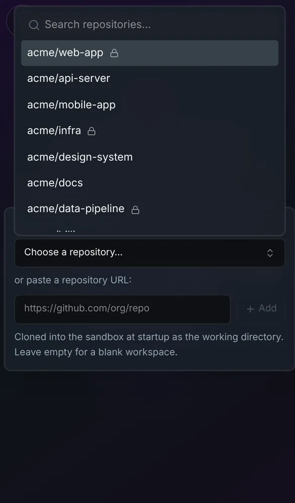

# GitHub repository picker

Connect a GitHub App, and you can pick repositories from your GitHub account
when you start a session.

Sessions can clone and push to every repository the App is installed on,
private ones included. You don't also need `mise run setup-git-token`.

## Set it up

1. Run `mise run setup-github-app`. It prints the settings to use for a new
   GitHub App, then asks for its Client ID, Client secret and slug.
2. In Omnigent, go to **Settings → Sandbox Integrations** and connect GitHub.

Each user connects their own GitHub account, so each user gets their own
access.

## Good to know

- **Tokens are encrypted.** Each user's GitHub tokens are encrypted by a
  small Vault service inside the cluster before they're stored in the
  database. See the [threat model](../threat-model.md#github-tokens-and-vault)
  for what that protects against.
- **It works on phones.** Upstream's picker ran off the top of a phone's
  screen. It's patched to fit the screen, with the list scrolling inside it,
  and the keyboard only opens when you tap the search field.

  

## Turning it off

It's an optional setup step. Without it, there's no picker.

## How it works

- Vault runs from `kubernetes/base/vault.yaml`, and uses its Transit engine
  for the encryption.
- The key that unlocks Vault is stored in a Kubernetes Secret, so Vault comes
  back by itself after a restart.
- The server image adds the `hvac` Python client, so the server can talk to
  Vault.
- `images/server/web-patches/0006-mobile-repo-picker.patch` keeps the picker
  on a phone's screen. The same fix applies to the branch picker next to a
  picked repository.
