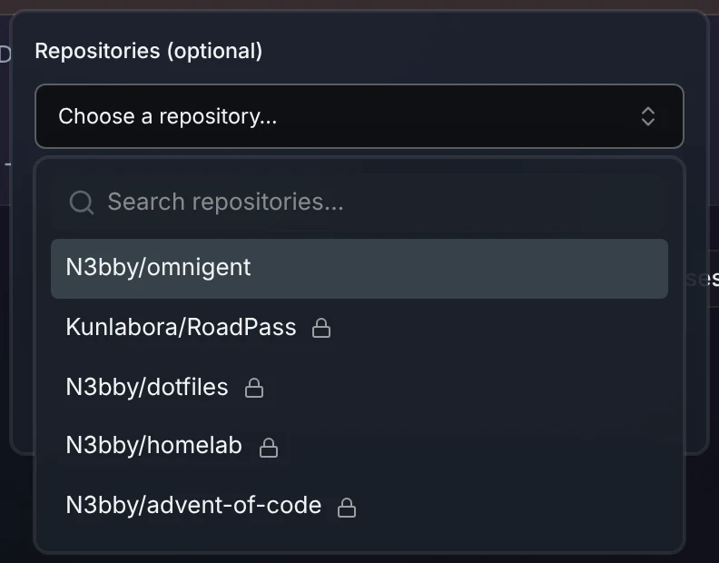
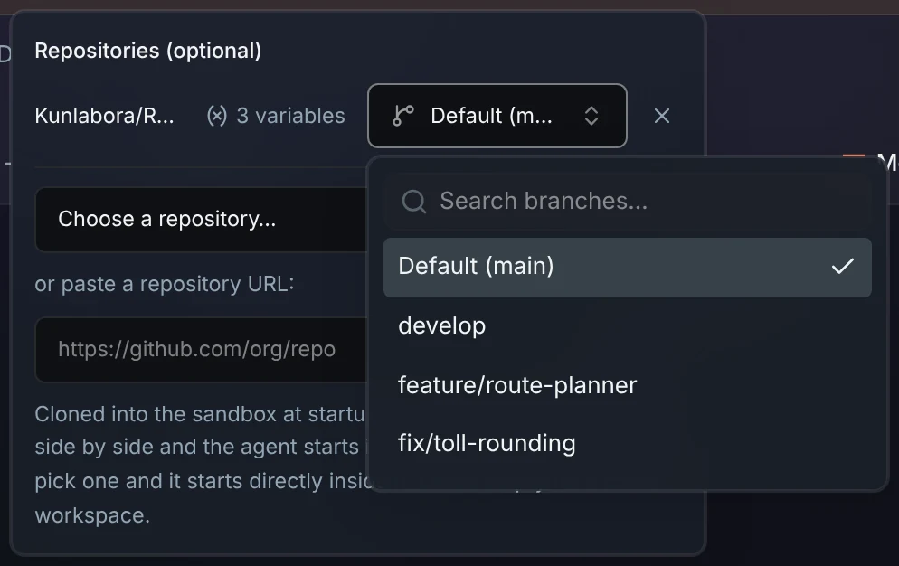
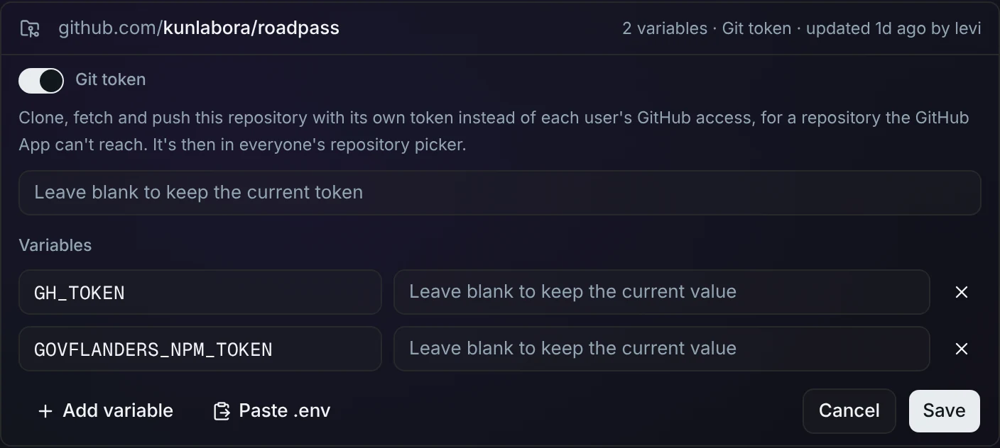
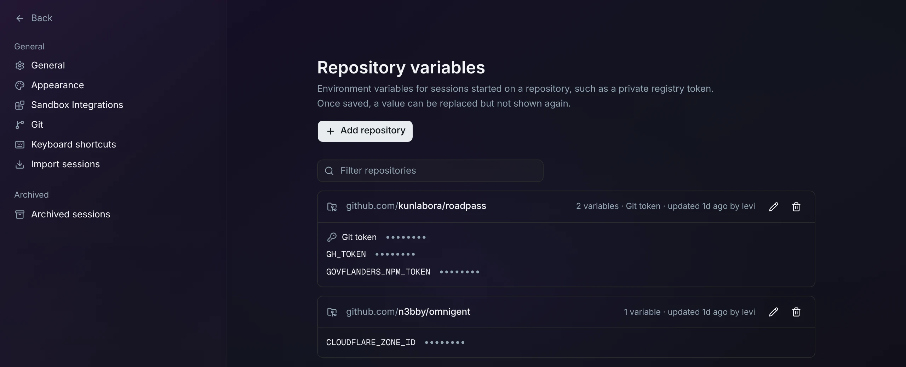

# A repository's own Git token

Work on a repository the [GitHub App](github-repo-picker.md) can't reach,
such as one in an organization you can't install the App on. Give the
repository its own token, and it shows up in the repository picker like any
other. Its sessions clone, fetch and push it with that token.

## What you'll see

The repository is in the new-session repository picker, between your own
repositories, newest push first:



Once picked, its branch menu lists its branches, read with its token, and it
shows its [variables](repo-env.md), the token among them:



## Set it up

1. Create a [fine-grained token](https://github.com/settings/personal-access-tokens)
   on GitHub with access to only that repository: **Contents: Read and
   write**, plus **Pull requests: Read and write** if the agent should open
   pull requests. The organization may have to approve it.
2. In Omnigent, go to **Settings → Repository variables** (admins only) and
   add the repository, or edit it if it already has variables. Turn on
   **Git token** and paste the token. To use `gh` in its sessions too, add
   the variable `GH_TOKEN` with the same value.

   

   Like a variable's value, the token can be replaced but not shown again.
   Leave its field blank to keep it.

The repository's card then lists **Git token** above its variables:



From the command line, the token is the variable `GIT_TOKEN`:
`mise run setup-repo-env kunlabora/roadpass` with a `GIT_TOKEN=…` line works
too. See [repository variables](repo-env.md#from-the-command-line).

Start a new session and pick the repository.

## Good to know

- **Everyone who has connected GitHub sees it** in their picker, and anyone
  who starts a session on it can use the token. Keep the token to that one
  repository. See the
  [threat model](../threat-model.md#trade-offs-worth-knowing).
- **Only that repository uses the token.** Every other repository in the
  session keeps using your own GitHub access.
- **Pasting its URL works too**, instead of picking it. Use an HTTPS URL; an
  SSH URL ignores the token.
- **The token stays out of the checkout.** Git reads it from the Secret each
  time, so a new token reaches running sessions, idle ones included once they
  wake.
- **Without a working token, the session doesn't start.** The clone fails,
  and its log says why, for example `Write access to repository not granted`:

  ```bash
  ./scripts/kube logs <pod> -n omnigent-sandboxes -c workspace-prep
  ```
- **Some organizations block personal tokens.** Then only installing the
  GitHub App on the organization helps.
- **It's listed even when GitHub won't show it to the token.** It then has
  no branches and no push time, so it sorts last.

## Turning it off

Edit the repository, turn off **Git token** and save. It leaves the picker,
and git in its sessions stops authenticating to it.

## How it works

- **The variable:** the token is the repository's `GIT_TOKEN`
  [variable](repo-env.md#how-it-works), in its Secret in
  `omnigent-sandboxes`. The agent gets it in its environment like the others.
- **The switch** (`images/server/web-patches/0012-repo-git-token-field.patch`):
  the Settings page shows `GIT_TOKEN` as **Git token**, apart from the
  variables, and edits it with its own switch and field. It refuses
  `GIT_TOKEN` as a variable name, and a `GIT_TOKEN` line in a pasted `.env`
  fills the token field. The server sees an ordinary variable.
- **The picker** (`images/server/patches/0010-repo-git-token.patch`): the
  repository and branch routes, `/v1/connections/github/repos` and
  `/v1/connections/github/repos/{owner}/{repo}/branches`, call
  `add_token_repositories` and `repository_token` in
  `images/server/omnigent_repo_env_api.py`.
  - The server reads the github.com repositories with a `GIT_TOKEN` from the
    Secrets, and asks GitHub for each one's details with its own token. The
    tokens never reach the browser.
  - A repository the App already lists keeps the App's entry.
  - A repository with a `GIT_TOKEN` lists its branches with it, whoever asks.
- **The clone** (same patch): the `workspace-prep` init container now mounts
  the repositories' Secrets too. For an HTTPS URL whose Secret has
  `GIT_TOKEN`, `clone_command` in `images/server/omnigent_repo_env.py`
  clones with only that token.
- **Fetch and push:** the checkout's own `.git/config` clears the GitHub App
  credential helper that Omnigent puts in the global git config, and adds one
  that reads the mounted token file. Because it reads the file, nothing
  changes when the Pod wakes, and the token itself is never written down.
- **The picker needs no web patch:** it shows what the routes return.
