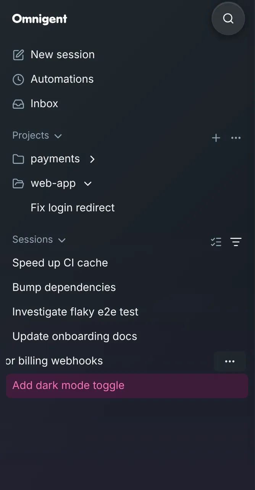
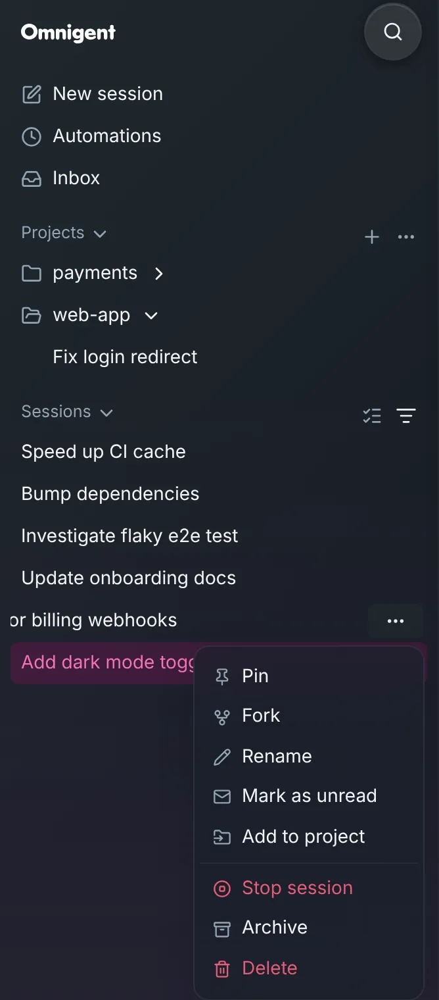

# Swipe for a session's menu

On a phone or tablet, swipe a session in the sidebar from right to left. The
row slides over and shows a **⋯** button. Tap it for the session's menu: Pin,
Fork, Rename, Archive, Delete and the rest, the same menu a right-click opens
on a computer.

## Why this is needed

In upstream Omnigent, holding a session down on a phone does two things at
once. It picks the session up to move it to a project, and a moment later it
also opens the menu. The row jumps around under the menu.

## What you'll notice

- **Holding a session down only picks it up.** Drag it onto a project or
  **Pinned** as before. Lifting your finger without moving it doesn't open
  the session.
- **Swipe left for the menu.** Swipe right, or tap the row, to put it back.
  Tapping anywhere else, scrolling, or picking something from the menu puts
  it back too. Only one session is swiped open at a time.
- **Scrolling is unchanged.** A swipe only counts when it's more sideways
  than up or down.
- **On a computer nothing changes,** at any window size: right-click a
  session, or use its **⋯** on hover. A laptop with a touchscreen counts
  as a computer.

## Turning it off

You can't.

## How it works

The web UI patch `images/server/web-patches/0007-sidebar-swipe-menu.patch`
turns it on where the browser reports no hover and a coarse pointer
(`(hover: none) and (pointer: coarse)`), and there:

- switches off the long-press menu on session rows, so a long press is only
  the drag
- counts a touch as a swipe once it has moved 10 pixels, more sideways than
  up or down, and leaves anything else to scrolling and the drag
- keeps the button showing after a swipe of more than half its width (52
  pixels), or a quick flick
- opens the row's own menu from that button, so its items are the ones on
  a computer
